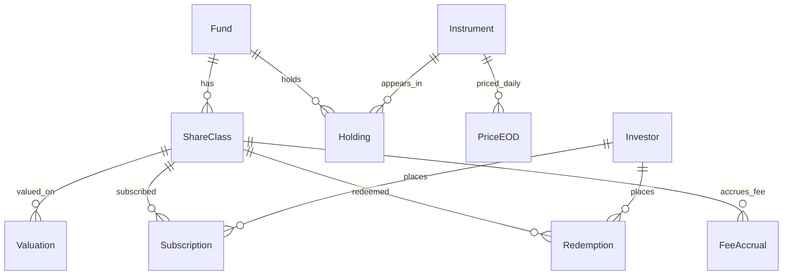

# Model domeny

Model opisuje, jak encje bazy `baseFunds` wspoltworza odpowiedz MVP:
fundusz + data => `NavPerUnit` (na poziomie klasy jednostek) oraz 5 najwiekszych pozycji (na poziomie funduszu).

## Granica modelu MVP

- Wejscie: `fundId`, `valuationDate` (oraz wynikajacy z konfiguracji/kontekstu `shareClassId`, jesli potrzebny).
- Wyjscie: `fundId`, `fundName`, `shareClassId`, `currency`, `valuationDate`, `netAssetValue`, `unitsOutstanding`, `navPerUnit`, `topHoldings`.
- Tryb pracy: read-only.

## Relacje encji

Minimalne sciezki danych:
- Sciezka NAV: `Fund -> ShareClass -> (Subscription, Redemption, Valuation)`.
- Sciezka pozycji: `Fund -> Holding -> Instrument -> PriceEOD`.

## Reguly wyliczen (kanon)

### 1) Jednostki w obrocie
Dla klasy jednostek `S` i daty `D`:

$$
units\_outstanding(S,D)=\sum Subscription.Units(S,TradeDate\le D)-\sum Redemption.Units(S,TradeDate\le D)
$$

Interpretacja implementacyjna:
- Sumujemy `Subscription.Units` i `Redemption.Units` dla tego samego `ShareClassId`.
- Uzywamy warunku granicznego `TradeDate <= D`.

### 2) NAV na jednostke

$$
NavPerUnit(S,D)=\frac{NetAssetValue(S,D)}{units\_outstanding(S,D)}
$$

Gdzie:
- `NetAssetValue(S,D)` pochodzi z `Valuation.NetAssetValue` dla (`ShareClassId = S`, `ValuationDate = D`).
- `NavPerUnit` moze byc odczytany z `Valuation.NavPerUnit`, ale semantycznie musi byc zgodny z powyzsza formula.

### 3) Wartosc pozycji i top 5
Dla pozycji `H` funduszu `F` na date `D`:

$$
market\_value(H,D)=Holding.Quantity(H,D)\times PriceEOD.ClosePrice(InstrumentId(H),D)
$$

Top 5 pozycji:
- Wyznaczamy `market_value` dla pozycji funduszu na date `D`.
- Sortujemy malejaco po `market_value`.
- Zwracamy pierwsze 5 rekordow.

## Rozroznienie poziomow (krytyczne)

- Poziom `ShareClass` (klasa jednostek):
  - `Subscription`, `Redemption`, `Valuation`
  - `units_outstanding`, `NetAssetValue`, `NavPerUnit`
- Poziom `Fund` (fundusz):
  - `Holding`, ranking `topHoldings`

Konsekwencja:
- Nie wolno liczyc `units_outstanding` ani `NavPerUnit` bez wskazania klasy jednostek.
- Nie wolno budowac top 5 z tabel klasy jednostek; ranking jest oparty o pozycje funduszu i ceny instrumentow.

## Ograniczenia i zalozenia MVP

- Brak modyfikacji danych (brak DML/DDL).
- `FeeAccrual` jest poza zakresem wyliczen endpointu MVP.
- Brak przeliczen FX: walute raportujemy zgodnie z waluta klasy jednostek.
- Dla braku danych (`fundId` nie istnieje lub brak wyceny na `valuationDate`) API zwraca kontrolowany komunikat biznesowy.

## Mapowanie na odpowiedz API

Przyklad mapowania pol:
- `fundId` <- `Fund.FundId`
- `fundName` <- `Fund.Name`
- `shareClassId` <- `ShareClass.ShareClassId`
- `currency` <- `ShareClass.Currency`
- `valuationDate` <- parametr wejsciowy i `Valuation.ValuationDate`
- `netAssetValue` <- `Valuation.NetAssetValue`
- `unitsOutstanding` <- regula 1
- `navPerUnit` <- regula 2
- `topHoldings[*].instrumentId` <- `Instrument.InstrumentId`
- `topHoldings[*].name` <- `Instrument.Name`
- `topHoldings[*].quantity` <- `Holding.Quantity`
- `topHoldings[*].closePrice` <- `PriceEOD.ClosePrice`
- `topHoldings[*].marketValue` <- regula 3
